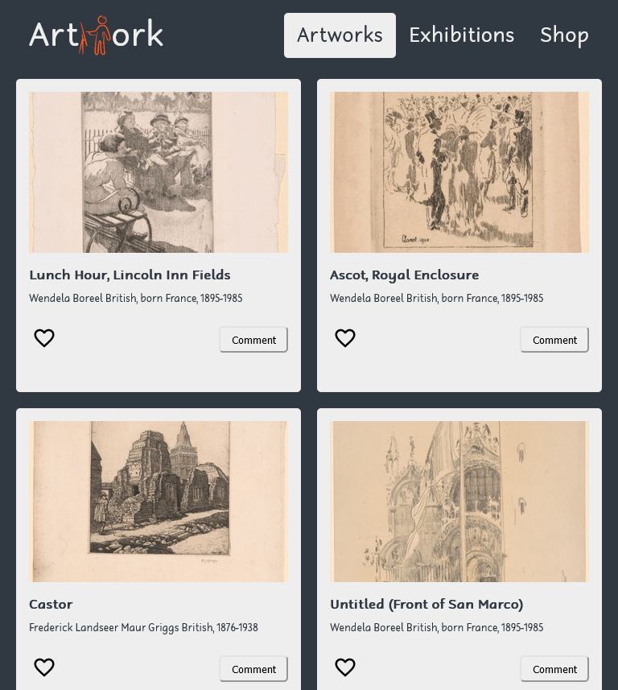

# Artwork Listing App (API-based webapp)

## 📗 Table of Contents

- [📖 Overview](#about-project)
  - [Project Requirements](#project-requirements)
    - [API](#api)
    - [User Stories](#user-stories) 
- [🛠 Built With](#built-with)
    - [Tech Stack](#tech-stack)
    - [Key Features](#key-features)
- [🚀 Live Demo](#live-demo)
- [📸 Screenshots](#screenshots)
  - [Desktop](#desktop)
  - [Tablet](#tablet)
  - [Mobile](#mobile)
- [💻 Getting Started](#getting-started)
  - [Setup](#setup)
  - [Prerequisites](#prerequisites)
  - [Install](#install)
  - [Run tests](#run-tests)
  - [Deployment](#deployment)
- [👥 Authors](#authors)
- [🔭 Future Features](#future-features)
- [🤝 Contributing](#contributing)
- [⭐️ Show your support](#support)
- [🙏 Acknowledgements](#acknowledgements)
- [📝 License](#license)

## 📖 Overview 

This project will be a group capstone project to create a single-page web application based on the Art Institute of Chicago's API. The application will be built with webpack 5 and Sass, and provide an intuitive user interface to view artworks from the Art Institute of Chicago. Additionally, the application will use Jest to test all JavaScript functions. 

The project involves developing a web application from scratch. As part of this, the group will need to research and familiarize themselves with the Art Institute of Chicago's API, as well as webpack 5 and Sass. The group will then implement a functional design with an intuitive user interface, HTML formatting, and stylesheet creation. Furthermore, the project will incorporate testing with Jest. 

By the end of the project, the team should have a completed web application that allows users to view artifacts from the Art Institute of Chicago, with the code tested using Jest.  

### Project Objectives 

#### API 

For this project, we explore the use of [Art Institute of Chicago API](https://api.artic.edu/docs/) to build a web application that allows users to view a list of artworks and like them using [Involvement API](https://www.notion.so/869e60b5ad104603aa6db59e08150270). The API provides data about artworks and their authors.

For this particular project, we will use the following endpoints:
> https://api.artic.edu/api/v1/artworks?page=2&limit=100&fields=id,title,artist_display,date_display,main_reference_number,image_id

#### User Stories 

- The following interfaces were built:
  - The *home page*.
  - The *comments popup*.
  - The *reservations popup*
- the given [layout](https://github.com/microverseinc/curriculum-javascript/blob/main/group-capstone/buisness_requirements.md#description) was followed with additional personalization(colors, typographies, spacings, etc).
- Home page
  - When the page loads, the webapp retrieves data from:
    - The selected API and shows the list of items on screen.
    - The Involvement API to show the item likes.
  - Remember that your page should make only 2 requests:
    - One to the base API.
    - And **one** to the Involvement API.
  - When the user clicks on the Like button of an item, the interaction is recorded in the Involvement API and the screen is updated.
  - When the user clicks on the "Comments" button, the Comments popup appears.
  - When the user clicks on the "Reservations" button, the Reservations popup appears (only for the groups of 3 students).
  - Home page header and navigation similar to the given mockup.
  - Home page footer similar to the given mockup.
- Comments popup
  - When the popup loads, the webapp retrieves data from:
    - The selected API and shows details about the selected item.
    - The Involvement API to show the item comments.
  - When the user clicks on the "Comment" button, the data is recorded in the Involvement API and the screen is updated.
- Reservations popup (only for the groups of 3 students)
  - When the popup loads, the webapp retrieves data from:
    - The selected API and shows details about the selected item.
    - The Involvement API to show the item reservations.
  - When the user clicks on the "Reserve" button, the data is recorded in the Involvement API and the screen is updated.
- We have counters in all the interfaces that show:
  - The number of items (home).
  - The number of comments (comments popup).
  - The number of reservations (reservations popup) - only for the groups of 3 students.
  - Each counter was implemented as a separate module.
  - A counter function looks for specific DOM elements (e.g. for the comments counter it should look for comments) and make the counting based on what is actually displayed on the page.
  - The counter function covers all the edge cases you can think about.

## 🛠 Built With 

### Tech Stack 

- [HTML](https://developer.mozilla.org/en-US/docs/Web/HTML)
- [JavaScript/ES6](https://262.ecma-international.org/6.0/)
- [webpack 5](https://webpack.js.org/)
- [npm](https://www.npmjs.com/)
- [Git](https://git-scm.com/)
- [GitHub](https://github.com)
- [Stylelinter](https://stylelint.io/)
- [ESLint](https://eslint.org/)
- [Webhint](https://webhint.io/)
- [Lighthouse](https://ethcar.github.io/lighthouse/)
- [SASS](https://sass-lang.com/)
- [API](https://api.artic.edu/docs/)

### Key Features 

- [x] Use ES6 modules, with import and export.
- [x] Use callbacks and promises.
- [x] Use Webpack to bundle JavaScript.
- [x] Write units tests for a JavaScript app.
- [x] Follow Gitflow.
- [x] Send and receive data from an API.
- [x] Use API documentation.
- [x] page counter.

## 🚀 Live Demo 

### Live Demo Link 
> [Live Demo Link](https://fmanimashaun.github.io/artwork-listing-app/)

> [Video Demo Link](#)

## 📸 Screenshots 

### Desktop 

  

  

### Tablet 

  

  

### Mobile 

  

  

## 💻 Getting Started 

- [Optional] Install git bash to your machine to enable you to clone this repo.
- install Visual Studio to be able to host a local live version.
- Install a browser to view the local live version.

To get a local copy up and running follow these simple example steps.

### Setup 

- Open your GitHub account the repository's [link](https://github.com/fmanimashaun/artwork-listing-app)

### Prerequisites 

- Internet connection
- A github account

### Install 

- copy the repo's link and clone it by writing `git clone https://github.com/fmanimashaun/artwork-listing-app.git` on your git bash terminal.
- `npm install` to install the dependencies.

### Run tests 

- You can check for errors by running linter tests found in the github flows.

### Deployment 

- run `npm run start` to run it locally.

## Authors 

👤 **Engr. Animashaun Fisayo**

- [GitHub](https://github.com/fmanimashaun)
- [Twitter](https://twitter.com/fmanimashaun)
- [LinkedIn](https://www.linkedin.com/in/fmanimashaun/)
- [Website](https://fmanimashaun.com)

👤 **Gerson Sanchez**

- [GitHub](https://github.com/gealsanchez)
- [Twitter](https://twitter.com/gealsanchez)
- [LinkedIn](https://www.linkedin.com/in/gerson-sanchez-88309b57/)

👤 **Francis Uche**

- [GitHub](https://github.com/francis3400)
- [Twitter](https://twitter.com/francisBlinkz)
- [LinkedIn](https://www.linkedin.com/in/francis-uche-888675213)

## 🤠Contributing 

Contributions, issues, and feature requests are welcome!

Feel free to check the [issues page](../../issues/).

## ⭐️ Show your suppor 

Give a ⭐️ if you like this project!

## 📠License 

This project is [MIT](./LICENSE) licensed.
